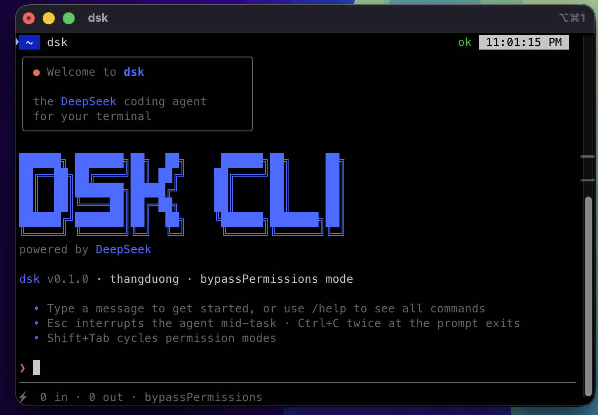

# DSK CLI — DeepSeek agentic CLI


A Claude-Code-style **agentic terminal tool** powered by the
[DeepSeek API](https://api-docs.deepseek.com). Launch `dsk` in any project
directory, type natural-language requests, and the agent reads/writes files,
searches the codebase, and runs shell commands — streaming DeepSeek's response
token-by-token to your terminal.

[](https://github.com/thangduonghuu/dsk-cli)
[](https://nodejs.org)
[](https://www.typescriptlang.org)
[](LICENSE)

## Table of contents

- [Screenshot](#screenshot)
- [Features](#features)
- [Quick start](#quick-start)
- [Requirements](#requirements)
- [Install](#install)
- [Setup](#setup)
- [Usage](#usage)
  - [Slash commands](#slash-commands)
  - [Input modes](#input-modes)
  - [Options](#options)
- [Configuration](#configuration)
- [Example session](#example-session)
- [Development](#development)
- [Contributing](#contributing)
- [Acknowledgements](#acknowledgements)
- [License](#license)
- [Notes](#notes)

## Screenshot



## Features

- **Claude-Code-style terminal UI** — colored `❯` prompt bar, dimmed thinking
  block, collapsed one-line tool results (`✓ bash: npm test (exit 0, 4.1s)`),
  and a live footer (tokens in/out · running cost · git branch · elapsed time ·
  permission mode).
- **DeepSeek welcome splash** — a Claude-Code-style welcome card with the
  `DSK CLI` ASCII wordmark in DeepSeek brand blue, a "powered by DeepSeek"
  tagline, version/context line, and getting-started tips.
- **Streaming replies** — tokens render as they arrive; the model's
  chain-of-thought is shown dimmed under a thinking header when thinking mode
  is on.
- **Agentic tool loop** — the model can read files, edit code, run tests, and
  keep going in one turn (capped at 25 iterations).
- **7 core tools** — `read_file`, `write_file`, `edit_file`, `list_dir`,
  `glob`, `grep` (ripgrep when available), `bash`.
- **No permission prompts by default** — tools run automatically, like
  DeepSeek's own chat UI. Cycle `default → acceptEdits → plan →
  bypassPermissions` with **Shift+Tab**, or set one with `/mode` / `--mode`.
- **Rich prompt editing** — multiline input (`\` + Enter / Ctrl+J), command
  history (↑/↓), `/`-command and `@`-file-path completion (Tab), `!cmd` shell
  mode, Ctrl+A/E/U/K/W editing, Esc to interrupt a turn.
- **Session persistence** — transcripts saved to `~/.dsk/sessions/`, resumable
  with `--resume <id>` or `--continue`.

## Quick start

```bash
npm i -g .
dsk                # first run prompts for your API key, then you're in the REPL
```

That's it — type a request like `explain this repo` or `fix the failing test`.

## Requirements

- Node.js 18.17+ (uses native `fetch`)
- A [DeepSeek API key](https://platform.deepseek.com/api_keys)

## Install

```bash
npm i -g .      # from this repository, or:
npm i -g dsk    # once published to npm
```

## Setup

```bash
dsk                              # first run: interactive setup prompts for your API key
# or:
dsk config set api-key sk-...
# or: export DEEPSEEK_API_KEY=sk-...
# or: pass --api-key sk-... per invocation
```

On first launch with no key configured, `dsk` asks for your API key with hidden
input, verifies it against the API, and saves it to `~/.dsk/config.json` with
`0600` permissions. The key is never printed to the terminal. (The interactive
prompt only appears on a real terminal — piped/non-TTY runs fail with an error,
so set the key via `config set`, `DEEPSEEK_API_KEY`, or `--api-key` first.)

## Usage

```bash
dsk                          # interactive REPL in the current directory
dsk "summarize this repo"    # one-off agentic turn, then exit
dsk --model deepseek-v4-pro  # use the stronger (more expensive) model
dsk --continue               # resume the most recent session
dsk --resume 2026-08-18T12-34-56-789Z   # resume a specific session
dsk config show              # view config (api key masked)
```

### Slash commands

| Command | Description |
| --- | --- |
| `/help` | Show help |
| `/clear` | Reset the conversation |
| `/model [name]` | List every available model (fetched live from `GET /models`) or switch directly, e.g. `/model deepseek-v4-pro` |
| `/config` | Show current configuration |
| `/usage` | Show token usage and cost for this session |
| `/diff` | Show the last file change as a unified diff |
| `/theme [name]` | Switch UI theme (`default` \| `ocean` \| `mono`) |
| `/color [name]` | Set the prompt-bar color (e.g. `/color pink`) |
| `/mode [mode]` | Show or set permission mode (Shift+Tab cycles) |
| `/exit` | Quit (Ctrl+C twice also works) |

### Input modes

- `!cmd` — run a shell command and add its output to the conversation.
- `\` + Enter / Ctrl+J — multiline prompt input.
- `/` + Tab — command completion; `@` + Tab — file-path completion.
- **Esc** — interrupt the agent mid-turn (partial work is kept).
- **Ctrl+C** — at a prompt: press twice to exit.
- **Ctrl+O** — page through the session transcript (via `less`, plain fallback).
- **Shift+Tab** — cycle permission modes.

### Options

| Flag | Description |
| --- | --- |
| `--model <name>` | Model to use (default `deepseek-v4-flash`) |
| `--api-key <key>` | API key (overrides env and config) |
| `--dangerously-skip-permissions` | Auto-approve all tool actions without prompting (redundant today — the default `bypassPermissions` mode already does this) |
| `--mode <mode>` | Permission mode (default `bypassPermissions` — no prompts): `default` \| `acceptEdits` \| `plan` \| `bypassPermissions` |
| `--permission-mode <mode>` | Alias for `--mode` |
| `--thinking <enabled\|disabled>` | Toggle DeepSeek thinking mode |
| `--reasoning-effort <low\|high\|max>` | Reasoning effort (default `high`) |
| `--theme <name>` | UI theme: `default` \| `ocean` \| `mono` |
| `--color <name>` | Prompt-bar color: `default` \| `red` \| `blue` \| `green` \| `yellow` \| `purple` \| `orange` \| `pink` \| `cyan` |
| `--base-url <url>` | Override the API base URL (testing) |
| `--fullscreen` | Run the REPL in the alternate (fullscreen) terminal buffer (also `dsk config set fullscreen true`) |
| `--resume <id>` / `--continue` | Resume a saved session |

Colors are forced on whenever stdout is a TTY, so the themed UI renders even if
your shell profile leaks `NO_COLOR=1`, `TERM=dumb`, or `FORCE_COLOR=0`.

## Configuration

`~/.dsk/config.json` supports:

| Key | Description |
| --- | --- |
| `apiKey` | DeepSeek API key |
| `model` | Model name (default `deepseek-v4-flash`) |
| `thinking` | Enable/disable thinking mode |
| `reasoningEffort` | `low` \| `high` \| `max` |
| `temperature`, `topP`, `maxTokens` | Sampling parameters (sent only in non-thinking mode) |
| `baseUrl` | API base URL override |
| `fullscreen` | Run in the alternate terminal buffer |
| `theme`, `promptColor` | UI theme and prompt-bar color |
| `mode` | Permission mode |

Set them with `dsk config set <key> <value>` — kebab-case aliases like
`api-key`, `top-p`, `max-tokens`, `base-url`, and `prompt-color` also work.

## Example session

```
dsk v0.1.0 · ~/projects/myapp · (main) · bypassPermissions mode

❯ Why is the test failing?
  █ Let me look at the test and the implementation.
  ⚙ read_file: test/x.test.ts
  ✓ read_file: Read file: test/x.test.ts
  ⚙ read_file: src/x.ts
  ✓ read_file: Read file: src/x.ts
  The failure is in `handle()`: it returns early on empty input.
  ⚙ edit_file: src/x.ts
  ✓ edit_file: Edit applied: src/x.ts (+1 −1 lines)
  ⚙ bash: npm test
  ✓ bash: npm test (exit 0, 4.1s)
  All tests pass now.
❯ _
⚡ 12.4k in · 3.1k out · $0.004 · (main) · 41s   esc to interrupt · shift+tab for permissions
```

## Development

```bash
npm install
npm run build     # tsc -> dist/
npm run dev       # run from source via tsx
npm test          # SSE parser + agentic loop tests (mock server)
```

## Contributing

Contributions are welcome! Please open an [issue](https://github.com/thangduonghuu/dsk-cli/issues)
for bugs and feature ideas, or a pull request for code changes. Before
submitting a PR:

1. Run `npm run typecheck` and `npm test` — both must pass.
2. Keep changes focused and covered by tests where practical.
3. Match the existing style (TypeScript, strict mode, no external deps beyond
   what's already in `package.json`).

## Acknowledgements

- [DeepSeek](https://www.deepseek.com) — the model + API this tool talks to.
- [Claude Code](https://docs.anthropic.com/en/docs/claude-code) — the terminal
  UX this project is styled after.

## License

[MIT](LICENSE) © 2026 thangduonghuu

## Notes

- DeepSeek thinking mode silently ignores `temperature`/`top_p` (per the API
  docs), so `dsk` only sends them in non-thinking mode.
- In multi-turn conversations where a tool call happened, the assistant's
  `reasoning_content` is echoed back to the API as the docs require.
- Non-goals for v1: multi-provider support, plugins/MCP, GUI.
